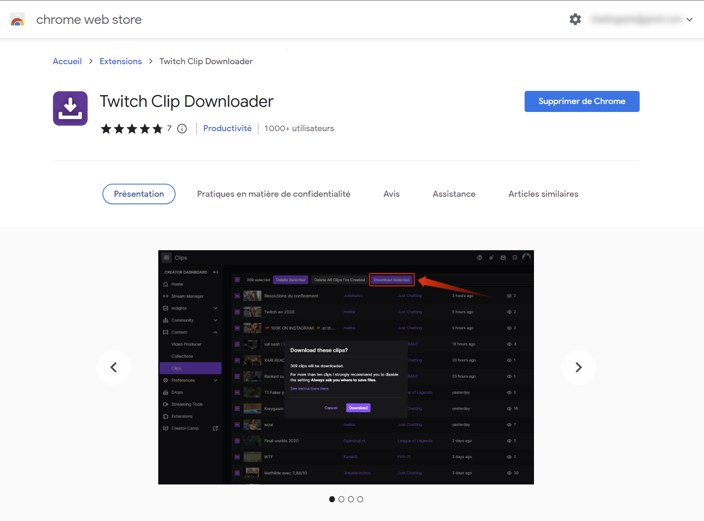
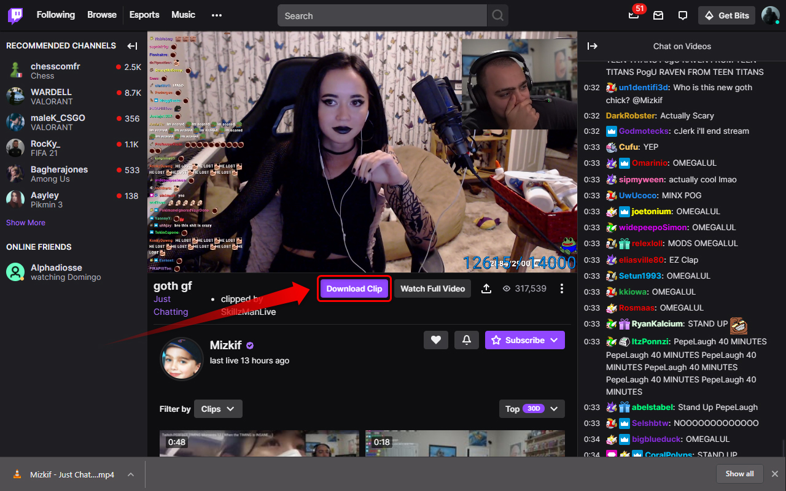
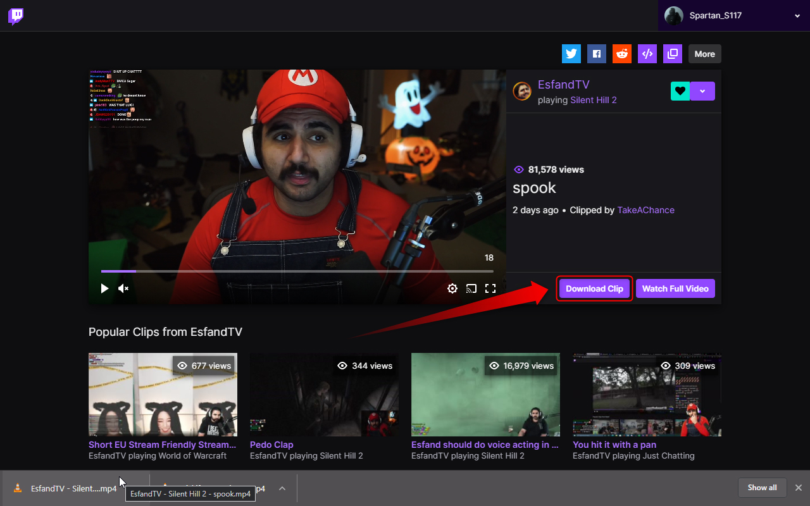
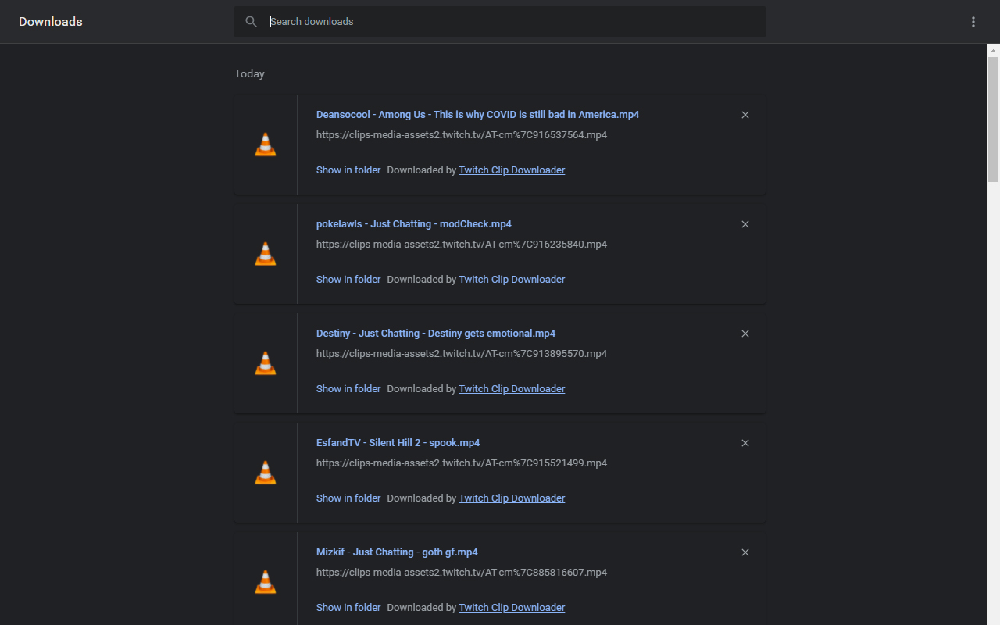

# Twitch Clip Downloader

## Table of Contents

* [About the Project](#about-the-project)
  * [Built With](#built-with)
* [Getting Started](#getting-started)
  * [Installation](#installation)
* [Screenshots](#screenshots)
* [Roadmap](#roadmap)
* [Contributing](#contributing)
* [License](#license)
* [Contact](#contact)
* [Acknowledgements](#acknowledgements)

## About The Project

Simplest way to download clips on Twitch!  
Twitch Clip Downloader adds a simple download button on the clips overview page.

It's the easiest way to download Twitch clip without quality less.  
Just click on the download button!

Are you afraid of losing clips you’ve made a long time ago?  
On the Clips Manager page, you can download all the clips you selected at the same time.

No need to rename a clip!  
To save time, clips will be renamed with the naming convention : *"Streamer - Category - Clip title.mp4"*

**You like it? Please leave a review!**

### Built With

* [Chrome APIs](https://developer.chrome.com/extensions/api_index)
* [jQuery 1.4.2](https://blog.jquery.com/2010/02/19/jquery-142-released/)
* Javascript

## Getting Started

### Installation

* [Click here to get Twitch Clip Downloader from the Chrome Store](https://chrome.google.com/webstore/detail/twitch-clip-downloader/dppnlpgimafbdjdlemjpbbokdeggemag)

## Screenshots

## Roadmap

See the [open issues](https://github.com/AxelConceicao/Bustabit-Script-Simulator/issues) for a list of proposed features (and known issues).

## Contributing

Contributions are what make the open source community such an amazing place to be learn, inspire, and create. Any contributions you make are **greatly appreciated**.

1. Fork the Project
2. Create your Feature Branch (`git checkout -b feature/AmazingFeature`)
3. Commit your Changes (`git commit -m 'Add some AmazingFeature'`)
4. Push to the Branch (`git push origin feature/AmazingFeature`)
5. Open a Pull Request

## License

Distributed under the MIT License. See `LICENSE` for more information.

## Contact

Project Link: [https://github.com/AxelConceicao/twitch-clip-downloader/](https://github.com/AxelConceicao/twitch-clip-downloader/)

## Acknowledgements

* [Chrome APIs](https://developer.chrome.com/extensions/api_index)
